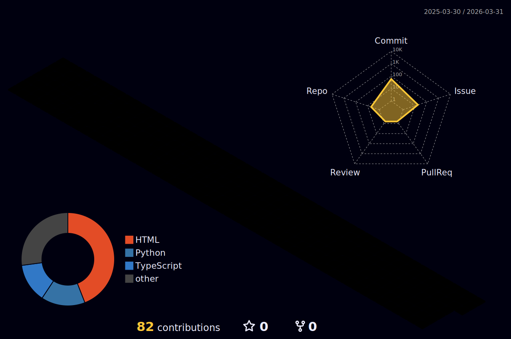

  

  
 |  |  |  
 | ----------- | ----------- |

 
  

   

  

 
##
   

     
  

  
 

<h1 align="center">Olá 👋, eu sou o Elvis Siqueira</h1>

Desenvolvedor Front-End em transição de carreira, apaixonado por tecnologia, aprendizado contínuo e por criar interfaces modernas, funcionais e acessíveis.

---

### 🚀 Sobre mim

- 👨‍💻 Atualmente trabalho como analista de suporte no TJDFT, com desenvolvimento em produção usando PHP, JavaScript e Git.
- 📘 Estudando: React, Next.js, Tailwind, TypeScript, Sass e Bootstrap.
- 🧠 Formação: Ciência de Dados (Escola DNC) e Análise e Desenvolvimento de Sistemas (Projeção/DF).
- 💼 Portfólio em construção com projetos práticos no FrontEnd.
- ✨ Curioso, analítico e com visão de negócios aplicada à tecnologia.

---

### 🛠️ Tecnologias & Ferramentas

---

### 📊 Estatísticas GitHub

  
  

---

### 🌐 Conecte-se comigo

---

> *“Transformando conhecimento em solução, código em impacto e desafios em evolução.”*

 
  
  

  

