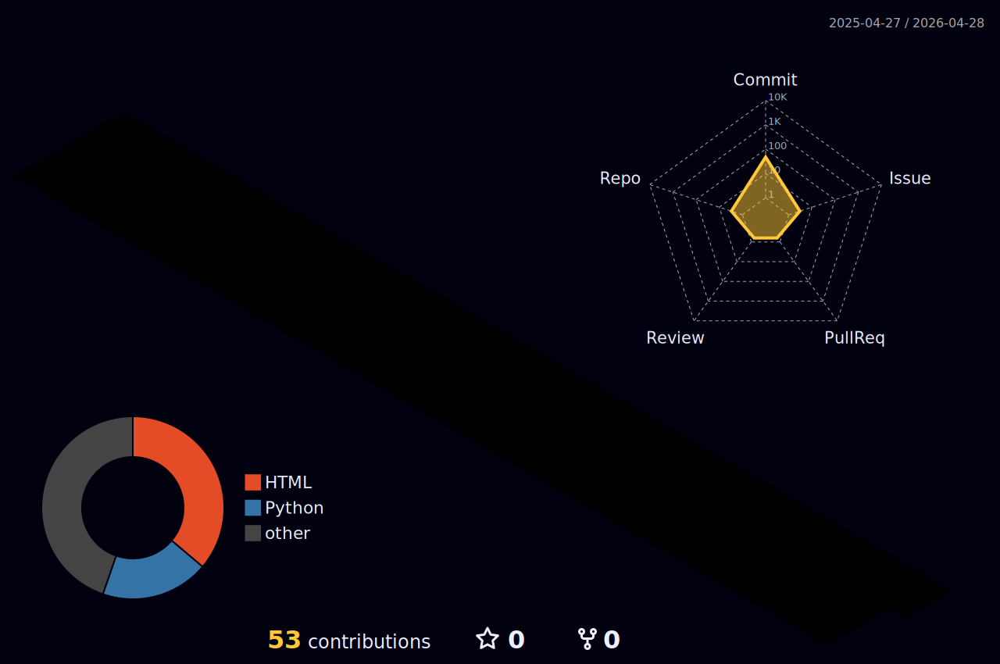

# Elvis Gonçalves de Siqueira
### DevSecOps Analyst | Python & Data Engineer

Analista DevOps/DevSecOps em evolução, com foco em automação, containers, CI/CD e integração de sistemas. Experiência prática com Python, Linux e ambientes produtivos.

  

  
 |  |  |  
 | ----------- | ----------- |

 

   

---
## 🚀 Sobre mim
Profissional de TI com **4+ anos de experiência real em produção** no TJDFT,
atuando com automações, administração Linux, APIs, dados e suporte a sistemas críticos.

Em transição estratégica para **Analista DevSecOps**, com foco em:
pipelines seguros, infraestrutura como código, GitOps e observabilidade.

---

## 🗺️ Roadmap DevSecOps 2026–2027
✅ Linux & Bash (TJDFT - produção)
✅ Python & Automação 
✅ Docker Fundação 
✅ Git & GitLab (TJDFT) 
🔄 GitHub Actions & CI/CD ← em andamento 
🔄 OpenShift & Kubernetes ← em andamento 
🔄 GitOps com Argo CD ← em andamento 
🔄 AWS & Terraform (IaC) ← em andamento 
⏳ SAST/DAST/SBOM Pipeline 
⏳ Observabilidade (Prometheus/Grafana) 
⏳ Certificação GitHub Actions 
⏳ Red Hat OpenShift Developer

---

## 📌 Projetos em Destaque

| Projeto | Descrição | Stack |
|---|---|---|
| [🔐 devsecops-pipeline](#) | Pipeline CI/CD com SAST, SCA e GitOps | Python, Actions, Argo CD |
| [🐍 python-automation-lab](#) | Automações Python com testes e CI | Python, Pytest, Docker |
| [📊 data-dashboard](#) | Dashboard público de dados | Pandas, Streamlit, SQL |
| [🏗️ terraform-aws-lab](#) | Infraestrutura como código na AWS | Terraform, AWS |
| [⚙️ openshift-labs](#) | Deployments e segurança no OpenShift | OpenShift, K8s, RBAC |

---

## 🏆 Certificações

- ✅ Scrum Fundamentals – SkillFront
- ✅ Lean Six Sigma White & Yellow Belt – FM2S
- ✅ Governança de TI – Fundação Bradesco
- ✅ Hacker Investigador – Técnicas de Invasão
- 🔄 Formação Python – OneBitCode (em andamento)
- 🔄 Cientista de Dados – DNC (em andamento)
- ⏳ GitHub Actions Certification (meta: Jul/26)
- ⏳ AWS Cloud Practitioner (meta: Out/26)

---

*"Automação não é substituir pessoas — é liberar pessoas para pensar."*

📧 siqueiraelvis0@gmail.com | 📍 Brasília/DF

  

